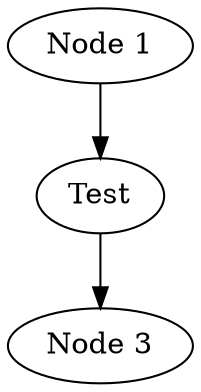
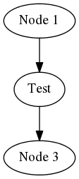
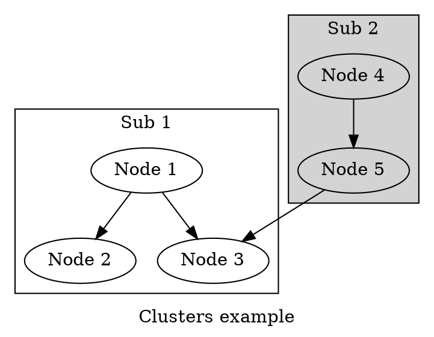
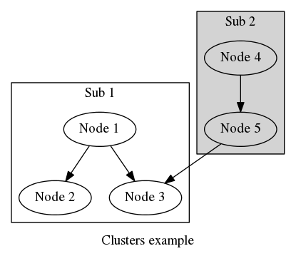

Graphviz-DSL
========================
_Graphviz directed (Dot) ~~and undirected (Fdf)~~ markup building DSL_


### Dot usage examples:
([source](src/test/scala/example/DotExamples.scala))

```scala
import feh.dsl.graphviz._
```

##### Example 1
```scala
class DotExample(indent: Int) extends DotDslImpl(indent){
    val g =
        Graph("Test 1")(
          Node("Node 1"),
          "Node 2" :| attr.Label("Test"),
          "Node 3".node,
          "Node 1" -> "Node 2",
          "Node 2" -> "Node 3"
        )

    val dot = write.graph(graph)

    val dotFile = File(???)
    GraphvizExec.writeAndExecGraphviz(dotFile, dot)(OutFormat.Png, Prog.Dot)
}
```
It generates following [dot](examples/example-1.dot)




##### Example 2
```scala
class DotExample(indent: Int) extends DotDslImpl(indent){
    val g =
        Cluster("Test 2", Label("Clusters example"))(
          Cluster("Sub 1", autoLabel)(
            "Node 1" -> "Node 2",
            "Node 1" -> "Node 3"
          ),
          Graph("Sub 2", cluster, autoLabel, fill)(
            "Node 4" -> "Node 5",
            "Node 5" -> "Node 3"
          )
        )

    val dot = write.graph(graph)

    implicit def format = OutFormat.Png
    implicit def graphProg = Prog.Dot

    val dotFile = File(???)
    GraphvizExec.writeAndExecGraphviz(dotFile, dot)
}
```
It generates following [dot](examples/example-2.dot)


